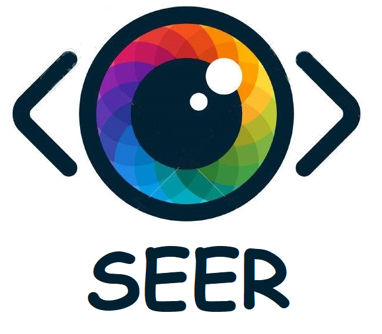

  
 

 <h2 align="center">Styling on the Go</h2>

------------------------------------------

>There are no open source implementations, that allow personalized clothing shopping by choosing from the most affordable alternatives of your favourite looks. We've made this easier, where all you have to do is take a screenshot or click a picture of a look you love to find similar, shopable items at prices you can afford.

&#10077; It's the user who explores which style he needs &#10078;

------------------------------------------
### Features

- `Capture` any apparel you love
- Browse across various preffered sources listed [here](https://github.com/kamakshi-01/Demo_Seer/tree/master/example%20csv%20files)
- `Get Recommendation` for affordable option of the same look

### Demonstration

<h3 align="center"> > Seer As Android-App  </h3>
 

  
  The Android app allows the user to style his/her next look just by capturing an image of the inspiration. A smart phone running our application just has to point the camera at the person wearing it, and it will process your request. The App processes the user query through our trained model which outputs similar outfits for you in your affordable price range. It directs you exactly to the shopping portal having the product you are looking for by choosing the best results for you. 
 This makes browsing,selecting and shopping all at your finger tips. No extra time specifically spent in going through various options and trying out how it looks, the next time you see a person on the go , sporting an outfit you would like to have, just take out your phone and click!  

------------------------------------------

### Add-Ons

- [ ] Styling suggestions based on user's previous decisions 
- [ ] Completing the look by recommending accessories
- [ ] Add More

### File Structure

#### Training Model

- `Scrappers` : Scrapper for scraping details and creating own dataset from various e commerce websites
- `App` : Android app which suggests affordable options of your inspiration outfit 

#### Android-App

- Repository [here](https://github.com/saloniagrawal12/Seer-Android.git)

------------------------------------------
