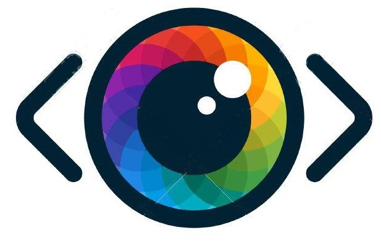

<p align="center">
  <a href="" rel="noopener">
 </a>
</p>
<h2 align="center"><i>SEER</h2>
<h3 align="center">Styling on the Go</h3>

<div align="center">

</div>

------------------------------------------

>There are no open source implementations, that allow personalized clothing shopping by choosing from the most affordable alternatives of your favourite looks. We've made this easier, where all you have to do is take a screenshot or click a picture of a look you love to find similar, shopable items at prices you can afford.

<div align="center">
&#10077; It's the user who decides which style he needs &#10078;
</div>


------------------------------------------
### Features

- `Subscriptions` for a news source
- `Bookmark` an article
- `Summarize` an source article or a url
- Browse across ~ 255 preffered source listed [here](./App/sources.csv)
- Featured Article as per all user reaction ( Also an Add-Ons )
- `Night-Mode` for better readiblity
- Subscribe to your favorite source using `chatbot` and read it on your own comfort from the `web-app`

<div align="center">

<h3 > Seer As Android-App  </h3>
<br>
<p align="center">

</p>


</div>

------------------------------------------

### Add-Ons

- [ ] Styling suggestions based on user's previous decisions 
- [ ] Completing the look by recommending accessories
- [ ] Add More

### File Structure


#### Training Model

- `App` : Source code for chatbot
- `Scrappers` : Scrapper for maintaining inital news distribution across web-app and chatbot using firebase . Deployment of this would result in frequent update the news

#### Android-App

- Repository [here](https://github.com/inishchith/Briefly-web/tree/master)

### Installation

```sh
        $ pip3 install -r requirements.txt
```

------------------------------------------
### Note

- This project was done under `14 hours with no pre-preparation`

------------------------------------------
